# How CanShrink works in Microsoft Access, and how to deal with some edge cases

Access' reports provide a great feature: shrinkable sections and controls, activated by setting their `CanShrink` properties to `True`.

There are some caveats, however, which can sometimes lead to unexpected results (i.e. "Why isn't this section shrinking???!!!")

The fundamental rule is this: 

Considering a horizontal band of a section, it will shrink if both of these conditions are true:

1. there is at least a shrinkable control with no content, and its `CanShrink` set to `True`
1. there is no control blocking the shrink. A control will not block shrink if:
    1. it is invisible, or
    1. it is shrinkable, and has no content

If these conditions are true, the horizontal band corresponding defined by the shrinkable control top and botton margin will shrink to nothing :-)

If a report contained only textboxes (with no labels) `CanShrink` would work flawlessly without any edge cases... BUT textboxes usually have labels, and there are also other controls which can be used on a report, and which don't have the `CanShrink` property.

Let's see what this means in practice, using this exceptional test table!

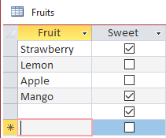

# Just a textbox

The easiest case is just a textbox, shrinkable, in a shrinkable section. The structure is shown in the image; i have added two lines to make clear when the shrink is happening

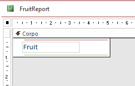

The result is predictable, and as expected

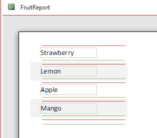

# A textbox and its label

Let's add a label

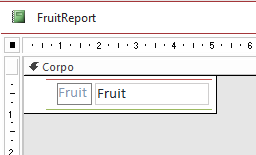

The label goes against both condition 2.1) and 2.2) above. It is not invisible, and it is not shrinkable: it will prevent shrinking even when the textbox is empty, and in fact we get

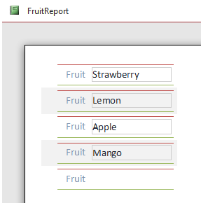

One of the most common solution discussed on the net is: replace the label with a shrinkable textbox, and set its value to `=IIF(ISNULL(Fruit), NULL, "Fruit")

This works, but I think it's a bit ugly. Also, this solution does not solve the problem of shrinking a band when it contains non shrinkable controls (like checkboxes).

So let's take the other way, which is using the `OnFormat` event of the section, to set the controls (and their labels) invisible based on their content.

Let's add this code

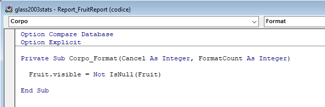

which will give us the wanted results :-)

# Shrinkable and not shrinkable controls

Let's add a non shrinkable control

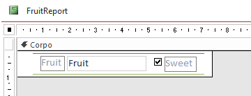

Since we must satisfy condition 2.1) above, we must also fix the formatting procedure

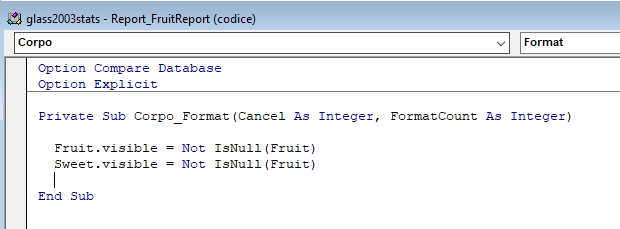

and...

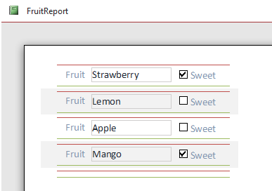

# Labels, labels everywhere

But labels can be everywhere, so what happens when we change our layout to 

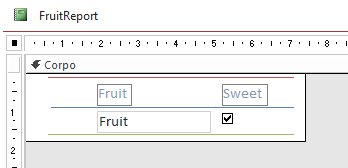

Well, we get a partial result... the band with the textboxes collapses, but the band with the labels doesn't, even if they are invisible

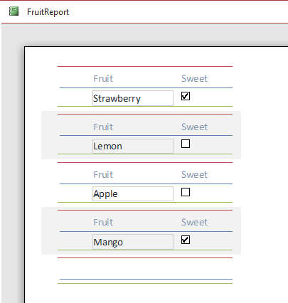

This is happening because the band with the labels does not satisfy condition 1): there is nothing to shrink!

The solution? just add an empty, shrinkable textbox, to signal to Access that the band should be shrinked, if possible.

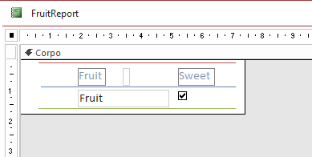

So when the labels are visible, the band won't be shrinked. But when they are hidden, the empty, shrinkable textbox will cause the shrinking of the whole band. And in fact...

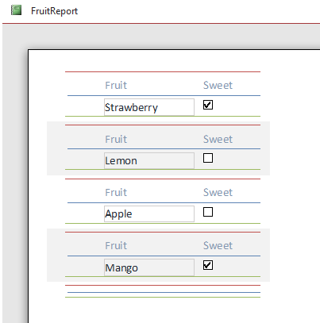

I have not seen this solution anywhere on the net, hope it will be useful to you :-)